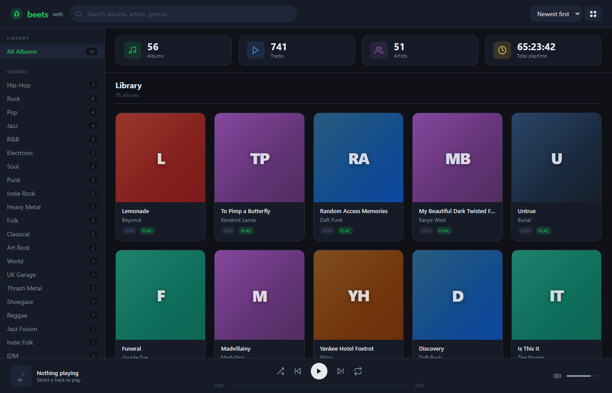

# beets web UI

A modern, self-hosted web management interface for the [beets](https://beets.io/) music library manager.

beets has been a beloved CLI tool since 2010 — this project brings it a full browser UI while staying true to its philosophy: fast, accurate, and in your control.



---

## Features

- **Album grid** — cover art via genre-color gradients, instant hover reveal
- **Track list** — click any album to drill into its tracks with format/bitrate info
- **Full-text search** — SQLite FTS5, sub-250ms results across title/artist/genre/label
- **Sidebar filters** — filter by genre, format (FLAC/MP3/etc), or artist in one click
- **Stats dashboard** — total albums, tracks, artists, and total playtime at a glance
- **Metadata editing** — PATCH any album's title, artist, year, genre, or label via modal
- **HTML5 audio player bar** — transport controls, progress scrubbing, volume (demo sim)
- **Dark theme** — Spotify-dark aesthetic, fully self-hosted
- **Demo mode** — 55 real albums seeded across 20+ genres, no beets installation required

---

## Quick Start

### Demo mode (no beets required)

```bash
# From the beets repo root:
pip install fastapi uvicorn

# Run the server
python -m uvicorn beets_web.app:app --port 8508 --reload

# Open in browser
open http://localhost:8508
```

The server seeds a SQLite demo library on first boot (`beets_web/demo_library.db`).

### With your real beets library (coming soon)

Set the `BEETS_DB` environment variable to point at your beets SQLite database:

```bash
BEETS_DB=~/.config/beets/library.db \
  python -m uvicorn beets_web.app:app --port 8508
```

Full beets-native integration (live query via `beet ls`, tag writing, reimport) is planned for v0.2.

---

## API Reference

All endpoints return JSON. Base URL: `http://localhost:8508`

| Method | Path | Description |
|--------|------|-------------|
| `GET`  | `/api/stats` | Library statistics |
| `GET`  | `/api/albums` | List/search albums (`?q=`, `?genre=`, `?artist=`, `?format=`, `?sort=`, `?limit=`, `?offset=`) |
| `GET`  | `/api/albums/{id}` | Album detail with full track list |
| `PATCH`| `/api/albums/{id}` | Update album metadata |
| `DELETE`| `/api/albums/{id}` | Remove album from library |
| `GET`  | `/api/tracks` | List/search tracks (`?q=`) |
| `PATCH`| `/api/tracks/{id}` | Update track metadata |
| `GET`  | `/api/genres` | Genre list with counts |
| `GET`  | `/api/artists` | Artist list with album counts |
| `GET`  | `/api/formats` | Format list with counts |

---

## Architecture

```
beets_web/
├── __init__.py        # Package version
├── app.py             # FastAPI app — API + demo data seeding
├── demo_library.db    # Auto-generated SQLite (55 demo albums)
└── static/
    └── index.html     # Single-file SPA — no build step, no Node
```

- **Backend:** FastAPI + SQLite (FTS5 for search)
- **Frontend:** Vanilla JS SPA — zero dependencies, zero build tooling
- **Demo data:** 55 classic albums across 20+ genres, seeded on first run
- **Port:** 8508

---

## Keyboard Shortcuts

| Key | Action |
|-----|--------|
| `Space` | Play/pause |
| `Escape` | Close modal / back to grid |
| `/` or `Ctrl+F` | Focus search |

---

## Roadmap

- [ ] Live beets database integration (read from `~/.config/beets/library.db`)
- [ ] Album art from MusicBrainz / Cover Art Archive
- [ ] Inline tag editing (write back via `beet modify`)
- [ ] Duplicate detection view
- [ ] Import queue UI (`beet import` wrapper)
- [ ] Playlist management
- [ ] Mobile-responsive layout

---

## Development

```bash
# Install deps (sherlock venv has them)
pip install fastapi uvicorn

# Dev server with hot reload
python -m uvicorn beets_web.app:app --port 8508 --reload

# Reset demo data
rm beets_web/demo_library.db
# Restart server — it re-seeds automatically
```

---

## Why not the existing `beets web` plugin?

The built-in `beet web` plugin is read-only, built on Bottle, and hasn't seen significant updates in years. This project aims to be a full replacement with:

- Modern UI framework (FastAPI)
- Write operations (edit, delete)
- Full-text search
- Real-time stats
- A UI people actually want to use

---

## License

Same as beets: [MIT License](LICENSE)
